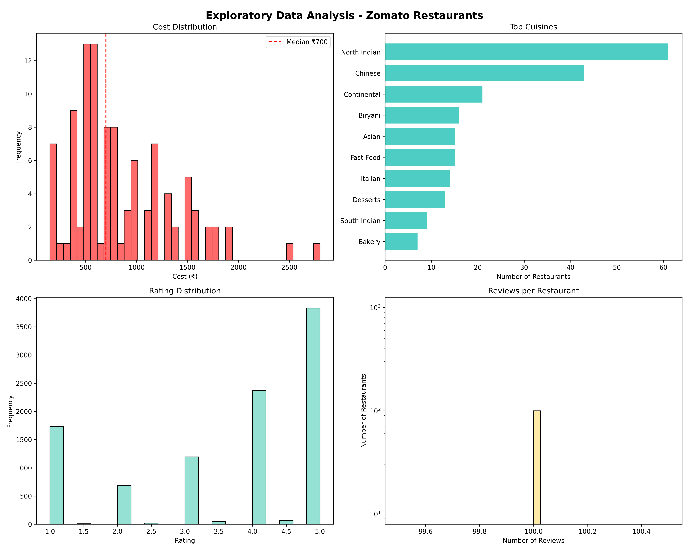
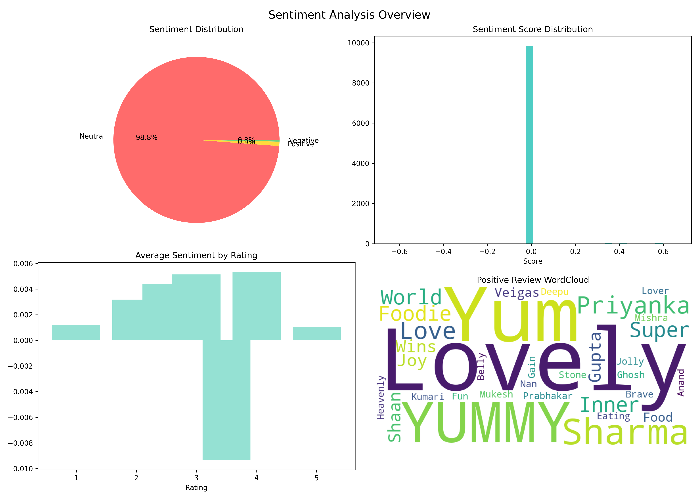
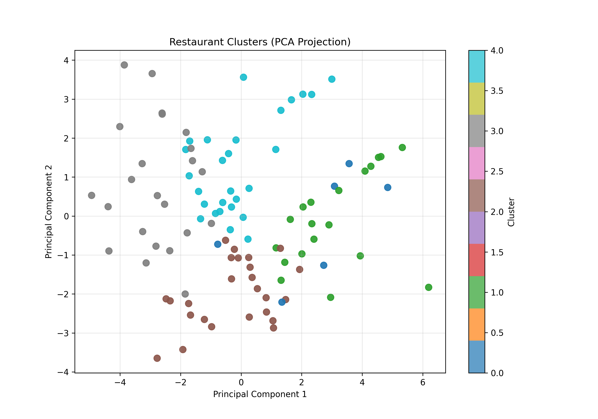

# 🍽️ Zomato Restaurant Clustering & Sentiment Analysis


> **End-to-end Data Science Capstone Project** — Clustering 200 Zomato restaurants into 5 business segments using KMeans + Hierarchical Clustering, with VADER NLP Sentiment Analysis on 9,955 customer reviews.

---

## 📊 Project Overview

This project analyses **200 restaurants** and **9,955 customer reviews** from Zomato to:
- Understand restaurant pricing, cuisine, and rating patterns through **EDA**
- Extract sentiment signals from reviews using **VADER NLP**
- Engineer composite features capturing real-world restaurant quality
- Segment restaurants into **5 meaningful business clusters** using **KMeans + Hierarchical Clustering**

---

## 🔬 10 Experiments

| # | Experiment | Key Technique |
|---|-----------|--------------|
| 01 | Data Loading | `pd.read_csv()`, encoding, validation |
| 02 | Exploratory Data Analysis | `plt.hist()`, `barh()`, `yscale("log")` |
| 03 | Data Cleaning | `strip()`, IQR outliers, regex, cuisine imputation |
| 04 | Sentiment Analysis | VADER `SentimentIntensityAnalyzer`, WordCloud |
| 05 | Restaurant Aggregation | `groupby().agg()`, name normalization |
| 06 | Feature Engineering | `popularity_score`, `value_score`, cuisine dummies |
| 07 | Scaling & PCA | `StandardScaler`, `PCA(n_components=0.95)` |
| 08 | KMeans Clustering | `KMeans(k=5)`, Silhouette Score |
| 09 | Hierarchical Clustering | `AgglomerativeClustering(linkage="ward")` |
| 10 | Cluster Profiling | `groupby().agg()`, PCA scatter visualization |

---

## 📈 Key Results

| Metric | Value |
|--------|-------|
| Total Restaurants | 200 |
| Total Reviews | 9,955 |
| Clusters Found | 5 |
| Avg Cost | ₹700 |
| Avg Rating | 3.60 ★ |
| Avg Sentiment | ~0.003 (Neutral) |

---

## 🗂️ Cluster Profiles

| Cluster | Label | Avg Cost | Avg Rating | Popularity |
|---------|-------|----------|------------|------------|
| 0 | Mid-Range Satisfied | ₹1,017 | 3.79 ★ | 190 |
| 1 | Premium Diners | ₹1,518 | 3.78 ★ | 189 |
| 2 | Budget Average | ₹700 | 3.19 ★ | 160 |
| 3 | Budget Gems 💎 | ₹411 | 3.39 ★ | 170 |
| 4 | Best Value Stars ⭐ | ₹937 | 4.00 ★ | 197 |

> **Cluster 4 — Best Value Stars** is the sweet spot: highest rating (4.0★), highest popularity (197), at a reasonable ₹937 average cost.

---

## 📁 Project Structure

```
Zomato/
│
├── zomato.py                     # Main analysis script (10 experiments)
├── output_artifacts/
│   ├── 01_eda_overview.png       # EDA charts
│   ├── 02_sentiment_analysis.png # Sentiment charts + WordCloud
│   ├── 03_pca_clusters.png       # KMeans PCA scatter plot
│   ├── cluster_profiles.csv      # Cluster summary table
│   ├── restaurants_clustered.csv # Full dataset with cluster labels
│   ├── kmeans_model.pkl          # Saved KMeans model (joblib)
│   └── analysis_summary.json     # Project summary stats
└── README.md
```

---

## 🛠️ Tech Stack

```python
# Data
pandas, numpy

# Visualization
matplotlib, seaborn, wordcloud

# Machine Learning
scikit-learn  # KMeans, AgglomerativeClustering, PCA, StandardScaler, silhouette_score

# NLP
nltk  # VADER SentimentIntensityAnalyzer

# Utilities
joblib, re, json, datetime
```

---

## 🚀 How to Run

```bash
# 1. Clone the repo
git clone https://github.com/Raj-Verma-1998/Zomato.git
cd Zomato

# 2. Install dependencies
pip install pandas numpy matplotlib seaborn scikit-learn nltk wordcloud joblib

# 3. Download NLTK data
python -c "import nltk; nltk.download('vader_lexicon'); nltk.download('stopwords')"

# 4. Update file paths in CONFIG (zomato.py lines 42-43)
# 'RESTAURANT_CSV': 'path/to/Zomato Restaurant names and Metadata.csv'
# 'REVIEWS_CSV':    'path/to/Zomato Restaurant reviews.csv'

# 5. Run
python zomato.py
```

---

## 📊 Visualizations

### EDA Overview


### Sentiment Analysis


### Restaurant Clusters (PCA Projection)


---

## 💡 Key Insights

- **Pricing is right-skewed** — most restaurants cluster below ₹1,000, median = ₹700
- **North Indian dominates** — 60+ restaurants out of 200
- **98.8% reviews are Neutral** (VADER) — short review text limits NLP signal
- **Feature Engineering was critical** — `value_score` and `popularity_score` created business-meaningful clusters
- **Cluster 4 = ideal restaurant model** for Zomato recommendations

---

## 👨‍💻 Author

**Raj Verma**
- GitHub: [@Raj-Verma-1998](https://github.com/Raj-Verma-1998)

---

## 📄 License

This project is open source and available under the [MIT License](LICENSE).

